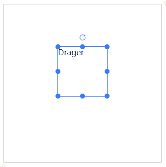
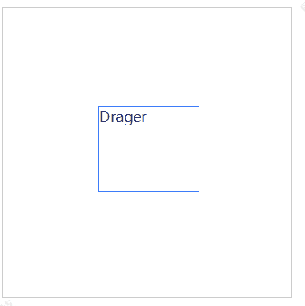

# 可拖拽、缩放、旋转组件实现细节

## 🌈介绍

基于 vue3.x + CompositionAPI + typescript + vite 的可拖拽、缩放、旋转的组件

- 拖拽&区域拖拽
- 支持缩放
- 旋转

目标效果



[源码地址](https://github.com/vangleer/es-drager)

## 拖拽&区域拖拽



虽然叫拖拽，但却跟拖拽事件没有一点关系，主要使用mousedown、mousemove、mouseup事件来实现

### 代码实现

```html
<template>
  <div
    ref="dragRef"
    :class="['es-drager']"
    :style="dragStyle"
    @mousedown="onMousedown"
  >
    <slot />
  </div>
</template>

<script setup lang='ts'>
import { computed, ref } from 'vue'
// 单位处理
const withUnit = (val: number | string = 0) => {
  return parseInt(val + '') + 'px'
}
const props = defineProps({
  boundary: { // 边界
    type: Boolean
  },
  width: {
    type: [Number, String],
    default: 100
  },
  height: {
    type: [Number, String],
    default: 100
  },
  left: {
    type: [Number, String],
    default: 0
  },
  top: {
    type: [Number, String],
    default: 0
  },
  color: {
    type: String,
    default: '#3a7afe'
  }
})
const emit = defineEmits(['move', 'resize'])

// 拖拽元素
const dragRef = ref<HTMLElement | null>(null)
// 是否按下鼠标
const isMousedown = ref(false)
// 拖拽数据
const dragData = ref({
  width: props.width,
  height: props.height,
  left: props.left,
  top: props.top
})
const dragStyle = computed(() => {
  const { width, height, left, top } = dragData.value
  return {
    width: withUnit(width),
    height: withUnit(height),
    left: withUnit(left),
    top: withUnit(top),
    '--es-drager-color': props.color
  }
})

/**
 * 鼠标按下事件
 */
function onMousedown(e: MouseEvent) {
  isMousedown.value = true
  const el = dragRef.value!
  
  // 记录按下的位置
  const downX = e.clientX
  const downY = e.clientY

  const elRect = el.getBoundingClientRect()
  // 鼠标在盒子里的位置
  const mouseX = downX - elRect.left
  const mouseY = downY - elRect.top

  const onMousemove = (e: MouseEvent) => {
    // 当前鼠标的位置减去鼠标在盒子里的位置就是要移动的距离
    let moveX = e.clientX - mouseX
    let moveY = e.clientY - mouseY
    
    dragData.value.left = moveX
    dragData.value.top = moveY
    emit && emit('move', dragData.value)
  }

  const onMouseup = (_e: MouseEvent) => {
    isMousedown.value = false
    // 移除document事件
    document.removeEventListener('mousemove', onMousemove)
    document.removeEventListener('mouseup', onMouseup)
  }
  // 位document注册鼠标移动事件
  document.addEventListener('mousemove', onMousemove)
  // 鼠标抬起事件
  document.addEventListener('mouseup', onMouseup)
}
</script>

<style lang='scss'>
.es-drager {
  position: absolute;
  z-index: 1000;
  border: 1px solid var(--es-drager-color, #3a7afe);
}
</style>

```

可以看到，核心逻辑主要在 onMousedown 事件处理函数中

步骤分析：

  1. 为拖拽元素注册mousedown事件
  2. 鼠标按下记录当前鼠标的位置，鼠标在元素中的位置
  3. 给document注册mousemove、mouseup事件
  4. mousemove事件中计算当前元素的位置
  5. mouseup中移除document事件


### 添加边界(区域拖拽)

区域拖拽主要是为了限制元素只能在最近定位父级元素中移动

```typescript
function onMousedown(e: MouseEvent) {
  isMousedown.value = true
  const el = dragRef.value!
  const downX = e.clientX
  const downY = e.clientY
  const elRect = el.getBoundingClientRect()

  // 鼠标在盒子里的位置
  const mouseX = downX - elRect.left
  const mouseY = downY - elRect.top

  // 提前计算最小最大边界值
  let minX = 0, maxX = 0, minY = 0, maxY = 0
  if (props.boundary) {
    const parentEl = el.parentElement || document.body
    const parentElRect = parentEl!.getBoundingClientRect()
    // 最小x
    minX = parentElRect.left
    // 最大x
    maxX = parentElRect.left + parentElRect.width - elRect.width
    // 最小y
    minY = parentElRect.top
    // 最大y
    maxY = parentElRect.top + parentElRect.height - elRect.height
  }

  const onMousemove = (e: MouseEvent) => {
    let moveX = e.clientX - mouseX
    let moveY = e.clientY - mouseY

    if (props.boundary) {
      // 判断x最小最大边界
      // moveX = moveX < minX ? minX : moveX > maxX ? maxX : moveX
      moveX = moveX < minX ? minX : moveX
      moveX = moveX > maxX ? maxX : moveX
      
      // 判断y最小最大边界
      // moveY = moveY < minY ? minY : moveY > maxY ? maxY : moveY
      moveY = moveY < minY ? minY : moveY
      moveY = moveY > maxY ? maxY : moveY
    }
    
    dragData.value.left = moveX
    dragData.value.top = moveY
    emit && emit('move', dragData.value)
  }

  const onMouseup = (_e: MouseEvent) => {
    isMousedown.value = false
    document.removeEventListener('mousemove', onMousemove)
    document.removeEventListener('mouseup', onMouseup)
  }
  document.addEventListener('mousemove', onMousemove)
  document.addEventListener('mouseup', onMouseup)
}
```

边界值说明：

  1. 最小x，最近定位父级标签的left
  2. 最大x，最近定位父级标签的left + 父级的width - 元素的width
  3. 最小y，最近定位父级标签的top
  4. 最大y，最近定位父级标签的top + 父级的height - 元素的height

## 缩放


可以看到元素周围有8个小圆点，可以从不同的方向放大或缩小元素

### 显示小圆点，计算位置

```html
<template>
  <div
    ref="dragRef"
    :class="['es-drager']"
    :style="dragStyle"
    @mousedown="onMousedown"
  >
    <slot />

    <div v-show="selected">
      <div
        v-for="item in dotList"
        :key="item.side"
        class="es-drager-dot"
        :data-side="item.side"
        :style="getDotStyle(item)"
        @mousedown="onDotMousedown(item, $event)"
      >
      </div>
    </div>
  </div>
</template>
<script setup lang='ts'>
import { computed, ref } from 'vue'

type IDotSide = 'top' | 'bottom' | 'left' | 'right' | 'top-left' | 'top-right' | 'bottom-left' | 'bottom-right'
type IDot = {
  side: IDotSide,
  cursor?: string
}
const dotList: IDot[] = [
  { side: 'top', cursor: 'n-resize' },
  { side: 'bottom', cursor: 'n-resize' },
  { side: 'left', cursor: 'e-resize' },
  { side: 'right', cursor: 'e-resize' },
  { side: 'top-left', cursor: 'se-resize' },
  { side: 'top-right', cursor: 'sw-resize' },
  { side: 'bottom-left', cursor: 'sw-resize' },
  { side: 'bottom-right', cursor: 'se-resize' }
]
const selected = ref(true)

const emit = defineEmits(['move', 'resize'])

// 计算圆点位置
function getDotStyle(item: IDot) {
  const [side, position] = item.side.split('-')
  const style = { [side]: '0%', cursor: item.cursor }
  if (!position) {
    const side2 = ['top', 'bottom'].includes(side) ? 'left' : 'top'
    style[side2] = '50%'
  } else {
    style[position] = '0%'
  }

  return style
}

function onDotMousedown(dotInfo: IDot, e: MouseEvent) {
  e.stopPropagation()
  e.preventDefault()
  // ...
}
</script>
<style lang='scss'>
.es-drager-dot {
  position: absolute;
  width: 10px;
  height: 10px;
  border-radius: 50%;
  background-color: var(--es-drager-color, #3a7afe);
  transform: translate(-50%, -50%);
  cursor: se-resize;
  &[data-side*="right"] {
    transform: translate(50%, -50%);
  }
  &[data-side*="bottom"] {
    transform: translate(-50%, 50%);
  }
  &[data-side="bottom-right"] {
    transform: translate(50%, 50%);
  }
}
</style>
```

- selected 选中拖拽元素时显示缩放小圆点
- 主要关注点还是在小圆点的拖拽上，onDotMousedown 事件处理函数

```typescript
function onDotMousedown(dotInfo: IDot, e: MouseEvent) {
  e.stopPropagation()
  e.preventDefault()
  // 获取鼠标按下的坐标
  const downX = e.clientX
  const downY = e.clientY
  const el = dragRef.value!
  const elRect = el.getBoundingClientRect()
  
  const onMousemove = (e: MouseEvent) => {
    // 移动的x距离
    const disX = e.clientX - downX
    // 移动的y距离
    const disY = e.clientY - downY

    const [side, position] = dotInfo.side.split('-')

    // 是否是上方缩放圆点
    const hasT = side === 'top'
    // 是否是左方缩放圆点
    const hasL = [side, position].includes('left')
    
    let width = elRect.width + (hasL ? -disX : disX)
    let height = elRect.height + (hasT ? -disY : disY)
    
    // 如果是左侧缩放圆点，修改left位置
    let left = elRect.left + (hasL ? disX : 0)

    // 如果是上方缩放圆点，修改top位置
    let top = elRect.top + (hasT ? disY : 0)

    if (!position) { // 如果是四个正方位
      if (['top', 'bottom'].includes(side)) {
        // 上下就不改变宽度
        width = elRect.width
      } else {
        // 左右就不改变高度
        height = elRect.height
      }
    }

    // 处理逆向缩放
    if (width < 0) {
      width = -width
      left -= width
    }
    if (height < 0) {
      height = -height
      top -= height
    }

    dragData.value = { left, top, width, height }
    emit('resize', dragData.value)
  }

  const onMouseup = (_e: MouseEvent) => {
    document.removeEventListener('mousemove', onMousemove)
    document.removeEventListener('mouseup', onMouseup)
  }
  document.addEventListener('mousemove', onMousemove)
  document.addEventListener('mouseup', onMouseup)
}
```

解析：

  1. 鼠标按下记录按下的坐标
  2. 移动时分别计算x和y移动的距离
  3. 右方和下方缩放比较好实现，直接改变宽高就行，原来的宽度+移动的距离
  4. 需要注意的是上方和左方的缩放，因为这两个方向，不仅要修改宽高，还需要修改位置
  5. `let width = elRect.width + (hasL ? -disX : disX)` 如果是左侧缩放圆点，现在的宽度减去移动的x距离。同时 `let left = elRect.left + (hasL ? disX : 0)` left需要加上移动的x，可能这样写更好理解一点

  ```typescript
    let width = elRect.width, left = elRect.left
    if (hasL) {
      width -= disX
      left += disX
    } else {
      width += disX
    }
  ```
  6. 如果是四个正方向，上下无需修改宽度，左右无需修改高度


## 旋转


在计算角度的时候会使用到Math的atan2方法，返回从原点 (0,0) 到 (x,y) 点的线段与 x 轴正方向之间的平面角度 (弧度值)，也就是 Math.atan2(y,x)

关于旋转按钮的样式就不贴代码了，直接从mousdown事件开始吧

```typescript
function onRotateMousedown(e: MouseEvent) {
  e.stopPropagation()
  e.preventDefault()
  const el = dragRef.value!
  const elRect = el.getBoundingClientRect()
  // 旋转中心位置
  const centerX = elRect.left + elRect.width / 2
  const centerY = elRect.top + elRect.height / 2

  function onMousemove(e: MouseEvent) {
    const diffX = centerX - e.clientX
    const diffY = centerY - e.clientY
    // Math.atan2(y,x) 返回从原点 (0,0) 到 (x,y) 点的线段与 x 轴正方向之间的平面角度 (弧度值)
    const radians = Math.atan2(diffY, diffX)

    // 计算角度
    dragData.value.angle = radians * 180 / Math.PI - 90 // 角度
    emit('rotate', angle.value)
  }

  const onMouseup = (_e: MouseEvent) => {
    document.removeEventListener('mousemove', onMousemove)
    document.removeEventListener('mouseup', onMouseup)
  }
  document.addEventListener('mousemove', onMousemove)
  document.addEventListener('mouseup', onMouseup)
}
```

1. 首先要计算出旋转中心位置
2. 鼠标移动计算移动的点和中心点的距离
3. 使用Math.atan2计算弧度，注意 y 是第一个参数
4. 使用弧度计算出角度，后面减去了90是因为当前旋转按钮在正上方，而默认计算的是从正左方开始的


## 最后

细心的伙伴可能发现了一个问题，就是旋转后再缩放会很奇怪，而且旋转后鼠标经过缩放圆点上时的样式也不相称。

下次再来解决这个问题吧！
