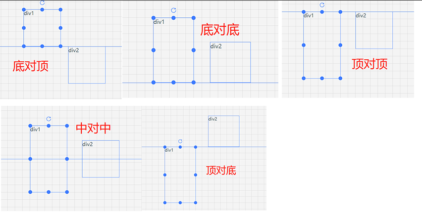
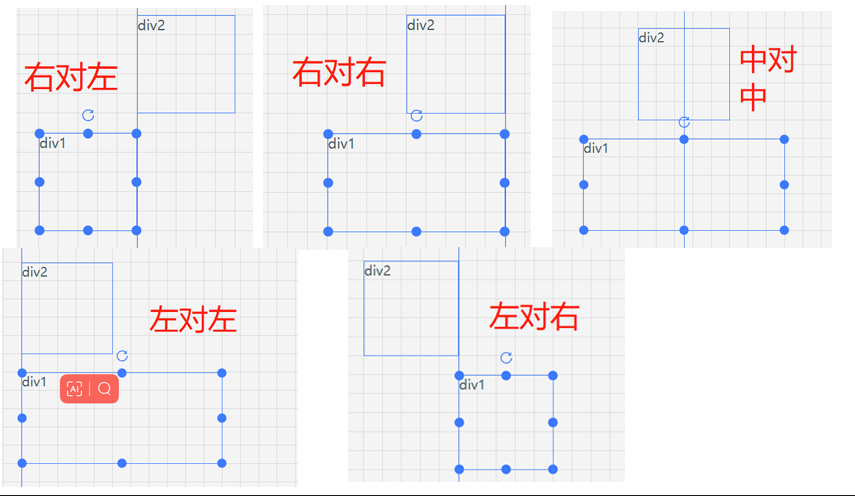
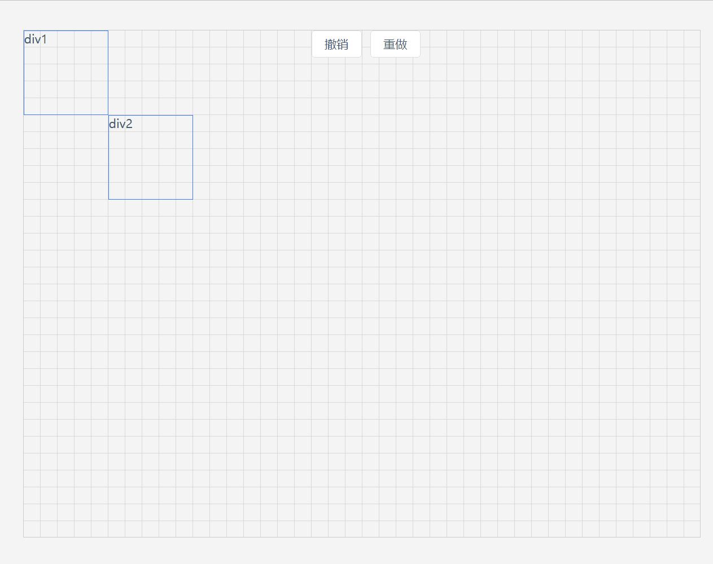

# 可拖拽、缩放、旋转组件实现细节之 - 生成辅助线和撤销回退功能

## 2024-1-5 更新

es-drager新增了关于辅助线和吸附的实现，其实思路和下面的方法大致一样。这次更新主要介绍一下使用方式

```html
<Drager :width="100" :height="100" snap markline>
  markline
</Drager>
```


辅助线是单例的，无论多少Drager组件开启辅助线，es-drager只会创建横纵轴各一条辅助线。而且辅助线只会挂载到最近一个定位父级元素，也就是 `offsetParent` 指向的元素

默认辅助线的颜色和Drager组件的颜色一样，可以通过 `es-drager-markline-x` `es-drager-markline-y` 进行修改

### 自定义辅助线

es-drager 也提供了自定义辅助线功能，markline支持传入回调函数，在回调函数中可以得到最新的辅助线数据

```html
<Drager
  :width="100"
  :height="100"
  snap
  :markline="onMarkline"
>
  custom markline
</Drager>
<div
  v-show="markLineData.left"
  class="es-editor-markline-left"
  :style="{ left: markLineData.left + 'px' }"
></div>
<div
  v-show="markLineData.top"
  class="es-editor-markline-top"
  :style="{ top: markLineData.top + 'px' }"
></div>

<script setup lang="ts">
import Drager, { DragData, MarklineData } from 'es-drager'

const markLineData = ref<MarklineData>({ left: null, top: null })

function onMarkline(data: MarklineData) {
  markLineData.value = data
}
</script>

<style lang="scss" scoped>
[class^='es-editor-markline'] {
  position: absolute;
  z-index: 9999;
  background-color: greenyellow;
}

.es-editor-markline-left {
  height: 100%;
  width: 1px;
  top: 0;
}
.es-editor-markline-top {
  width: 100%;
  height: 1px;
  left: 0;
}
</style>
```


[可查看在线示例](https://vangleer.github.io/es-drager/#/markline)


**=====================以下是原文=====================**

## 🌈介绍

基于 vue3.x + CompositionAPI + typescript + vite 的可拖拽、缩放、旋转的组件

*   拖拽&区域拖拽
*   支持缩放
*   旋转
*   网格拖拽缩放

[在线示例](https://vangleer.github.io/es-drager)

[源码地址](https://github.com/vangleer/es-drager)

这节主要来分享如何使用es-drager，根据现有功能实现拖拽时生成辅助线、撤销重做等画布常用功能

话不多说，咱们开始吧！

## 画布准备工作

这里只是一个简单的画布模板

### 画布数据源

```typescript
import { ref, CSSProperties } from 'vue'
// 组件类型
type ComponentType = {
  component: string // 内部组件名称，自定义组件需要提前全局注册
  text?: string // 文本
  width?: number
  height?: number
  top?: number
  left?: number
  angle?: number
  style?: CSSProperties // 样式
}

interface EditorState {
  componentList: ComponentType[]
}

const data = ref<EditorState>({
  componentList: [
    {
      component: 'div',
      text: 'div1',
      width: 100,
      height: 100,
      left: 0,
      top: 0
    },
    {
      component: 'div',
      text: 'div2',
      width: 100,
      height: 100,
      top: 100,
      left: 100
    }
  ]
})
```

循环渲染组件到画布上

```html
<Drager
  v-for="item in data.componentList"
  v-bind="item"
>
  <component :is="item.component">{{ item.text }}</component>
</Drager>
```

## 生成辅助线

当拖拽元素时，通过比较拖拽元素与画布上其他元素的位置，当某个元素与拖拽元素的距离接近时，显示辅助线

### 拖拽元素在垂直方向上不同对齐方式

1. 底对顶：拖拽元素的底部与对比元素的顶部对齐
2. 底对底：拖拽元素的底部与对比元素的底部对齐
3. 中对中：拖拽元素的中部与对比元素的中部对齐
4. 顶对顶：拖拽元素的顶部与对比元素的顶部对齐
5. 顶对底：拖拽元素的顶部与对比元素的底部对齐


看下图可以清晰的理解这几种对齐方式



### 拖拽元素在水平方向上不同对齐方式

1. 右对左：拖拽元素的右侧与对比元素的左侧对齐
2. 右对右：拖拽元素的右侧与对比元素的右侧对齐
3. 中对中：拖拽元素的水平中心与对比元素的水平中心对齐
4. 左对左：拖拽元素的左侧与对比元素的左侧对齐
5. 左对右：拖拽元素的左侧与对比元素的右侧对齐





理解了这几种对齐方式，接下来就用代码来实现吧！

### 代码实现

监听拖拽开始事件 `drag-start`，当前拖拽元素除外，保存其他所有元素的位置信息和判断条件用于生成辅助线。

在拖拽过程中，监听 `drag` 事件，并将拖拽元素的位置与之前保存的数据进行比较。如果满足生成辅助线的条件，则显示相应的辅助线。

```html
<template>
  <div
    class="es-container"
    :style="gridStyle"
  >
    <Drager
      v-for="item, index in data.componentList"
      v-bind="item"
      :snapToGrid="snapToGrid"
      :gridX="gridX"
      :gridY="gridY"
      @drag-start="onDragstart(index)"
      @drag="onDrag($event)"
      @change="onChange($event, item)"
    >
      <component :is="item.component">{{ item.text }}</component>
    </Drager>

    <div v-show="markLine.left" class="es-markline-left" :style="{ left: markLine.left + 'px' }"></div>
    <div v-show="markLine.top" class="es-markline-top" :style="{ top: markLine.top + 'px' }"></div>
  </div>
</template>

<script setup lang='ts'>
import { computed, ref, reactive, CSSProperties } from 'vue'
import Drager, { DragData } from 'es-drager'
const snapToGrid = ref(true)
const gridX = ref(20)
const gridY = ref(20)
const gridStyle = computed(() => {
  return snapToGrid.value ? {
    '--es-grid-width': gridX.value + 'px',
    '--es-grid-height': gridY.value + 'px'
  } : {}
})
const currentIndex = ref(-1)

const data = ref<EditorState>({
  componentList: [
    {
      component: 'div',
      text: 'div1',
      width: 100,
      height: 100,
      left: 0,
      top: 0
    },
    {
      component: 'div',
      text: 'div2',
      width: 100,
      height: 100,
      top: 100,
      left: 100
    }
  ]
})
const markLine = reactive({
  left: null,
  top: null
})

const lines = ref({ x: [], y: [] })

/**
 * 监听拖拽开始
 * @param index 
 */
function onDragstart(index: number) {
  currentIndex.value = index
  lines.value = calcLines()
}

/**
 * 监听拖拽事件
 * @param dragData 
 */
function onDrag(dragData: DragData) {
  markLine.top = null
  markLine.left = null
  for (let i = 0; i < lines.value.y.length; i++) {
    const { top, showTop } = lines.value.y[i]

    if (Math.abs(top - dragData.top) < 5) {
      markLine.top = showTop
      break
    }
  }

  for (let i = 0; i < lines.value.x.length; i++) {
    const { left, showLeft } = lines.value.x[i]

    if (Math.abs(left - dragData.left) < 5) {
      markLine.left = showLeft
      break
    }
  }
}

/**
 * 计算辅助线的位置
 */
function calcLines() {
  const lines: any = { x: [], y: [] }
  // 当前拖拽元素大小
  const { width, height } = data.value.componentList[currentIndex.value!] as any

  // 循环遍历画布所有元素，将除当前拖拽元素外所有其它元素生成辅助线的位置保存，每个元素x和y都会有5种
  data.value.componentList.forEach((block, i: number) => {
    if (currentIndex.value! === i) return
    const { top: ATop, left: ALeft, width: AWidth, height: AHeight } = block as any

    lines.x.push({ showLeft: ALeft, left: ALeft })
    lines.x.push({ showLeft: ALeft + AWidth, left: ALeft + AWidth })
    lines.x.push({ showLeft: ALeft + AWidth / 2, left: ALeft + AWidth / 2 - width / 2 })
    lines.x.push({ showLeft: ALeft + AWidth, left: ALeft + AWidth - width })
    lines.x.push({ showLeft: ALeft, left: ALeft - width })

    lines.y.push({ showTop: ATop, top: ATop })
    lines.y.push({ showTop: ATop, top: ATop - height })
    lines.y.push({ showTop: ATop + AHeight / 2, top: ATop + AHeight / 2 - height / 2 })
    lines.y.push({ showTop: ATop + AHeight, top: ATop + AHeight })
    lines.y.push({ showTop: ATop + AHeight, top: ATop + AHeight - height })
  })

  return lines
}

function onChange(dragData: DragData, item: any) {
  Object.keys(dragData).forEach((key) => {
    (item as any)[key] = dragData[key as keyof DragData]
  })
}
</script>

<style lang='scss' scoped>
.es-container {
  border: 1px solid #ccc;
  background:
        -webkit-linear-gradient(top, transparent calc(var(--es-grid-height) - 1px), #ccc var(--es-grid-height)),
        -webkit-linear-gradient(left, transparent calc(var(--es-grid-width) - 1px), #ccc var(--es-grid-width))
        ;
    background-size: var(--es-grid-width) var(--es-grid-height);
  width: 800px;
  height: 600px;
  position: absolute;
  left: 50%;
  top: 50%;
  transform: translate(-50%, -50%);

  [class^=es-markline] {
    position: absolute;
    z-index: 9999;
    background-color: #3a7afe;
  }
  .es-markline-left {
    height: 100%;
    width: 1px;
    top: 0;
  }
  .es-markline-top {
    width: 100%;
    height: 1px;
    left: 0;
  }
}
</style>
```

主要关注es-drager的几个事件

`onDragstart` 开始拖拽调用 `calcLines` 计算辅助线出现的位置

`onDrag` 拖拽时分别遍历提前计算好lines中x和y的位置是否满足显示辅助线，有一个满足就显示相应的辅助线

`onChange` 大小位置改变时更新最新数据

`calcLines` 解析：

函数中使用了一个 lines 对象来保存辅助线的位置信息。遍历画布上的所有元素（除了当前拖拽元素），并为每个元素计算并保存辅助线的位置。

对于垂直方向（y 轴），生成了五种辅助线的位置信息：

- 顶对顶：拖拽元素的顶部与对比元素的顶部对齐
- 顶对底：拖拽元素的顶部与对比元素的底部对齐
- 中：拖拽元素的中部与对比元素的中部对齐
- 底对顶：拖拽元素的底部与对比元素的顶部对齐
- 底对底：拖拽元素的底部与对比元素的底部对齐

对于每种对齐方式，lines 对象保存了两个位置信息：

showTop：用于显示辅助线的位置

top：用于计算对齐位置的参考位置


## 撤销与重做

最终效果展示



这里我们使用一个钩子来实现

```typescript
function useCommand(data: Ref<EditorState>) {
  const queue: ComponentType[] = [] // 画布变化记录
  let current = -1 // 前进后退指针
  // 重做
  const redo = () => {
    if (current < queue.length - 1) {
      current++
      data.value.componentList = deepCopy(queue[current])
    }
  }
  // 撤销
  const undo = () => {
    if (current >= 0) {
      current--
      if (queue[current]) {
        data.value.componentList = deepCopy(queue[current])
      }
    }
  }
  // 记录画布的变化
  const record = () => {
    queue[++current] = deepCopy(data.value.componentList)
  }

  // 记录初始数据
  record()

  // 键盘事件
  const onKeydown = (e: KeyboardEvent) => {
    const { ctrlKey, key } = e
    if (ctrlKey) {
      if (key === 'z') undo()
      else if (key === 'y') redo()
    } 
  }
  window.addEventListener('keydown', onKeydown)

  onBeforeUnmount(() => {
    window.removeEventListener('keydown', onKeydown)
  })
  return {
    redo,
    undo,
    record
  }
}
```

用一个数组 `queue` 来记录画布的变化，`current` 代表前进后退指针

`useCommand` 提供了 `redo`、`undo` 和 `record` 方法，用于重做、撤销和记录画布的变化。

- `redo` 重做方法就是拿到当前指针 `current` 的下一个数据
- `undo` 撤销方法得到当前指针 `current` 的上一个数据
- `record` 方法用于记录画布的变化。在每次画布发生变化的时候，调用该方法，将当前的画布数据存储到 `queue` 数组中，并将指针 `current` 向后移动一位，实现记录操作。例如添加/删除元素、拖拽结束、缩放结束等调用该方法

- 具体使用

为 `es-drager` 添加拖拽结束事件监听

```html
<Drager
  @drag-end="onDragend"
></Drager>
<script setup lang='ts'>

const command = useCommand(data)
function onDragend() {
  // 每次拖拽结束记录变化
  command.record()
}
</script>
```

## 最后

本文介绍了如何实现拖拽编辑器中的辅助线功能，以及如何使用撤销与重做来增强编辑器的交互性和用户体验。

查看完整代码请滑到顶部有 `github` 链接地址和在线示例

- 相关文章

[可拖拽、缩放、旋转组件实现细节](https://juejin.cn/post/7225152932675993655)

[可拖拽、缩放、旋转组件网格效果及使用方法](https://juejin.cn/post/7239895206081806373)